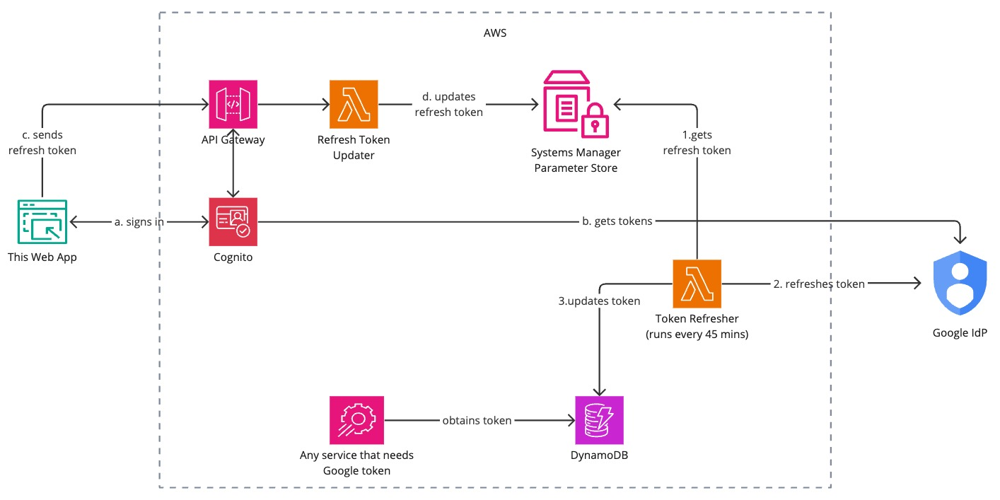

## Google Auth Token Manager

Enables a token owner to keep it separately for use in services that require it.

## Overview

If you want to share your Google Photos or Youtube Library outside of those apps you have to share your Google Account credentials.
This is not safe and not recommended. This app allows you to keep your Google Auth Token separately and use it in other apps that require it.

## Features

- **Authentication**: Setup with Amazon Cognito for secure user authentication.
- **API**: Integration with API Gateway.
- **Database**: Real-time database powered by Amazon DynamoDB.

## Architecture

### Phase One
User installs the webb app onto their phone and enables Push Notifications. Then the flow goes as follows:

- (a, b) User logs in with their Google Account and authorizes the app to access their Google Photos and Youtube Libraries.
As a result user obtains the Google Auth Tokens (including __refresh_token__).
- (c, d) User submits the Google Auth __refresh_token__ to the AWS SSM Parameter Store where it is kept securely.

### Phase Two
On a periodic basis (every 45 minutes) a dedicated lambda function refreshes Google Auth Token using __refresh_token__ 
and stores it in the DynamoDB database. If the __refresh_token__ is invalid the user is notified via Push Notification
so that they can re-authorize the app repeating the __Phase One__.

### Finally
Any other app that requires Google Auth Token can obtain it from the DynamoDB database.

## Prerequisites
In order to deploy the solution you need to have the following:
- Initiate an empty Amplify project.
- [Configure Google App](https://developers.google.com/photos/library/guides/get-started#configure-app) 
and add [Authorization Scopes](https://developers.google.com/photos/library/guides/authorization).
This solution is configured to get access to Google Photos and Youtube Libraries. So the scopes would be:
  - `https://www.googleapis.com/auth/photoslibrary.readonly`
  - `https://www.googleapis.com/auth/youtube.readonly`
- Setup secrets:
  - `APP_ID`: Amplify App ID
  - `GOOGLE_CLIENT_ID`: Google App ID
  - `GOOGLE_CLIENT_SECRET`: Google App Secret
- Connect the repository to the Amplify app.

## Sandbox Environment
In order to successfully deploy the solution to a sandbox you must provide APP_ID secret with `npx ampx sandbox secret set APP_ID`.

## Security

See [CONTRIBUTING](CONTRIBUTING.md#security-issue-notifications) for more information.

## License

This project is licensed under the MIT-0 License. See the LICENSE file.